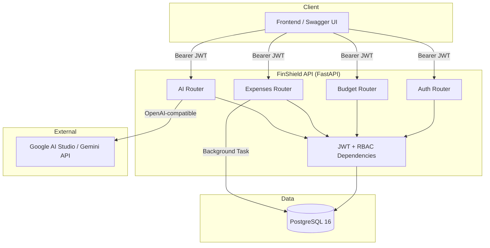

# FinShield API

**FinShield API** is a multi-tenant backend for corporate budget and expense management, with an integrated LLM-powered financial advisor. The project demonstrates production-ready patterns: async API design, per-organization data isolation, role-based access control (RBAC), database migrations, containerization, and automated CI.

> Built as a **technical portfolio project** — combining backend engineering practices with a focus on code clarity, testability, and security.

---

## Table of Contents

- [Key Features](#key-features)
- [Tech Stack](#tech-stack)
- [Architecture](#architecture)
- [Project Structure](#project-structure)
- [Requirements](#requirements)
- [Quick Start](#quick-start)
- [Docker](#docker)
- [Environment Variables](#environment-variables)
- [API Reference](#api-reference)
- [RBAC Model](#rbac-model)
- [Database & Migrations](#database--migrations)
- [Testing](#testing)
- [CI/CD](#cicd)
- [Security](#security)
- [Author & License](#author--license)

---

## Key Features

| Area | Description |
|------|-------------|
| **Multi-tenancy** | Each organization has isolated data — expenses and budgets are scoped by `organization_id` from the JWT |
| **JWT Authentication** | Company registration, OAuth2 login, tokens carrying `user_id`, `role`, and `org_id` |
| **RBAC** | `Admin` and `Employee` roles with distinct permissions for budgets and expenses |
| **Budget Guard** | Blocks expense creation/update when a category limit would be exceeded |
| **Background Alerts** | Logs a warning when category spending reaches ≥ 80% of the budget |
| **Aggregations** | Company-wide expense summary broken down by category |
| **AI Advisor** | Financial analysis via Gemini (OpenAI-compatible API) with safe fallback on errors |
| **Pagination & Filters** | Expense listing with `limit`, `offset`, `category`, `start_date`, `end_date` |
| **OpenAPI / Swagger** | Interactive documentation with examples and `persistAuthorization` |

---

## Tech Stack

| Layer | Technology |
|-------|------------|
| Framework | [FastAPI](https://fastapi.tiangolo.com/) 0.128 |
| Runtime | Python 3.9 |
| ORM | SQLAlchemy 2.0 (async) |
| Database | PostgreSQL 16 |
| Driver | asyncpg |
| Migrations | Alembic |
| Validation | Pydantic v2 + pydantic-settings |
| Auth | JWT (PyJWT) + bcrypt |
| HTTP Client (AI) | httpx |
| ASGI Server | Uvicorn |
| Testing | pytest + pytest-asyncio + httpx |
| Containerization | Docker + Docker Compose |
| CI | GitHub Actions |

---

## Architecture



**Typical request flow:**

1. Client authenticates via `POST /auth/login` and receives a JWT.
2. Token is sent in the `Authorization: Bearer <token>` header.
3. The `get_current_user` dependency decodes the token and loads the user from the database.
4. Endpoints operate only on data belonging to the user's organization (`organization_id`).

---

## Project Structure

```
finshield-api/
├── app/
│   ├── core/           # Config, database, security, JWT/RBAC dependencies
│   ├── models/         # SQLAlchemy models (Organization, User, Expense, Budget)
│   ├── routers/        # HTTP endpoints (auth, budgets, expenses, ai)
│   ├── schemas/        # Pydantic request/response schemas
│   ├── services/       # Business logic (AI advisor)
│   └── main.py         # FastAPI application entry point
├── migrations/         # Alembic migrations
├── tests/              # Integration tests (17 scenarios)
├── .github/workflows/  # GitHub Actions CI
├── docker-compose.yml
├── Dockerfile
├── requirements.txt        # Production dependencies
├── requirements-dev.txt    # Development dependencies (pytest)
├── alembic.ini
└── pytest.ini
```

---

## Requirements

- **Python 3.9+**
- **PostgreSQL 16** (local or via Docker)
- **Git**
- *(optional)* **Docker** and **Docker Compose**
- *(optional)* [Google AI Studio](https://aistudio.google.com/) API key — for `/ai/advice`

---

## Quick Start

### 1. Clone the repository

```bash
git clone <repository-url>
cd finshield-api
```

### 2. Virtual environment and dependencies

```bash
python3 -m venv venv
source venv/bin/activate        # Windows: venv\Scripts\activate
pip install -r requirements-dev.txt
```

### 3. Environment configuration

Create a `.env` file in the project root:

```env
# PostgreSQL
POSTGRES_USER=postgres
POSTGRES_PASSWORD=your_secure_password
POSTGRES_DB=finshield
POSTGRES_HOST=localhost
POSTGRES_PORT=5432

# JWT
JWT_SECRET=generate_a_long_random_secret
JWT_ALGORITHM=HS256
ACCESS_TOKEN_EXPIRE_MINUTES=30

# AI (Google AI Studio — OpenAI-compatible endpoint)
OPENAI_API_KEY=your_api_key
OPENAI_BASE_URL=https://generativelanguage.googleapis.com/v1beta/openai
AI_MODEL=gemini-2.5-flash

# Optional
SQL_ECHO=false
CORS_ORIGINS=http://localhost:3000,http://localhost:5173,http://127.0.0.1:3000
```

> **Note:** `.env` is not committed to the repository. Never embed real API keys in source code.

### 4. Database migrations

```bash
alembic upgrade head
```

### 5. Run the development server

```bash
uvicorn app.main:app --reload --host 0.0.0.0 --port 8000
```

| Resource | URL |
|----------|-----|
| Swagger UI | http://localhost:8000/docs |
| ReDoc | http://localhost:8000/redoc |
| Health check | http://localhost:8000/health |

---

## Docker

```bash
# Ensure .env exists in the project root
docker compose up -d --build
```

After containers start, run migrations inside the `web` container:

```bash
docker compose exec web alembic upgrade head
```

| Service | Container | Port |
|---------|-----------|------|
| API | `finshield_api` | `8000` |
| PostgreSQL | `finshield_postgres` | `5432` |

Docker Compose automatically:
- sets `POSTGRES_HOST=db` for the API container,
- waits for the database health check before starting the app,
- persists PostgreSQL data in the `postgres_data` volume.

Stop services:

```bash
docker compose down
```

---

## Environment Variables

| Variable | Required | Default | Description |
|----------|:--------:|---------|-------------|
| `POSTGRES_USER` | yes | — | PostgreSQL username |
| `POSTGRES_PASSWORD` | yes | — | PostgreSQL password |
| `POSTGRES_DB` | yes | — | Database name |
| `POSTGRES_HOST` | yes | — | Host (`localhost` locally, `db` in Docker) |
| `POSTGRES_PORT` | yes | — | PostgreSQL port (usually `5432`) |
| `JWT_SECRET` | yes | — | Secret key for signing JWT tokens |
| `JWT_ALGORITHM` | yes | — | JWT algorithm (e.g. `HS256`) |
| `ACCESS_TOKEN_EXPIRE_MINUTES` | yes | — | Token lifetime in minutes |
| `OPENAI_API_KEY` | yes | — | API key for the AI service |
| `OPENAI_BASE_URL` | yes | — | Base URL (OpenAI-compatible) |
| `AI_MODEL` | no | `gemini-2.5-flash` | LLM model identifier |
| `SQL_ECHO` | no | `false` | Log SQL queries (`true` / `false`) |
| `CORS_ORIGINS` | no | `localhost:3000,...` | Allowed frontend origins (comma-separated) |

`DATABASE_URL` is built automatically from `POSTGRES_*` variables in `app/core/config.py`.

---

## API Reference

### Infrastructure

| Method | Endpoint | Auth | Description |
|--------|----------|:----:|-------------|
| `GET` | `/health` | — | Application and configuration status |

### Authentication (`/auth`)

| Method | Endpoint | Auth | Description |
|--------|----------|:----:|-------------|
| `POST` | `/auth/register-company` | — | Register a company and its first administrator |
| `POST` | `/auth/login` | — | Login (form-data: `username`=email, `password`) |
| `POST` | `/auth/register-employee` | Admin | Add an employee to the organization |

### Budgets (`/budgets`)

| Method | Endpoint | Auth | Description |
|--------|----------|:----:|-------------|
| `POST` | `/budgets/` | Admin | Set a monthly limit for a category |
| `GET` | `/budgets/` | JWT | List organization budgets |

### Expenses (`/expenses`)

| Method | Endpoint | Auth | Description |
|--------|----------|:----:|-------------|
| `GET` | `/expenses/` | JWT | List expenses (pagination, filters) |
| `POST` | `/expenses/` | JWT | Create an expense (budget validation) |
| `GET` | `/expenses/summary` | JWT | Expense aggregation by category |
| `PATCH` | `/expenses/{expense_id}` | JWT | Update an expense (UUID) |
| `DELETE` | `/expenses/{expense_id}` | JWT | Delete an expense (UUID) |

**`GET /expenses/` query parameters:**

| Parameter | Type | Default | Description |
|-----------|------|---------|-------------|
| `limit` | int | `20` | Number of records (1–100) |
| `offset` | int | `0` | Pagination offset |
| `category` | string | — | Category filter |
| `start_date` | date | — | Start date (`YYYY-MM-DD`) |
| `end_date` | date | — | End date — includes the full day |

### AI Advisor (`/ai`)

| Method | Endpoint | Auth | Description |
|--------|----------|:----:|-------------|
| `GET` | `/ai/advice` | JWT | LLM-generated financial report |

### Swagger quick start

1. `POST /auth/register-company` — create a company.
2. `POST /auth/login` — log in (`username` field = email).
3. Click **Authorize** and paste the `access_token`.
4. `POST /budgets/` — set a category limit (as Admin).
5. `POST /expenses/` — add an expense.
6. `GET /ai/advice` — fetch the financial analysis.

---

## RBAC Model

| Operation | Admin | Employee |
|-----------|:-----:|:--------:|
| Create budget | ✅ | ❌ |
| View budgets | ✅ | ✅ |
| Add expenses | ✅ | ✅ |
| Edit own expenses | ✅ | ✅ |
| Edit others' expenses | ✅ | ❌ |
| Delete own expenses | ✅ | ✅ |
| Delete others' expenses | ✅ | ❌ |
| Add employees | ✅ | ❌ |

JWT payload includes: `sub` (user ID), `role`, `org_id` (organization ID).

---

## Database & Migrations

### Data model

```
organizations (1) ──< users
organizations (1) ──< expenses
organizations (1) ──< budgets
users (1) ──< expenses
```

**Business constraints:**
- unique organization name,
- unique user email,
- unique `(organization_id, category)` pair in `budgets`,
- composite index `(organization_id, created_at)` on expenses.

### Alembic commands

```bash
# Apply all migrations
alembic upgrade head

# Roll back one migration
alembic downgrade -1

# Generate a new migration (after model changes)
alembic revision --autogenerate -m "description"
```

---

## Testing

The project includes **17 integration tests** covering authentication, budgets, expenses, RBAC, and infrastructure.

```bash
# Run all tests
pytest

# Verbose output
pytest -v

# Single file
pytest tests/test_rbac.py -v
```

Tests require a running PostgreSQL instance configured in `.env` (same database as development — tests create unique data per scenario).

| Test file | Scope |
|-----------|-------|
| `test_auth.py` | Registration, login, duplicates, employee invites |
| `test_budget.py` | Budget creation, category uniqueness |
| `test_expenses.py` | Budget guard, CRUD, validation, aggregations, filters |
| `test_rbac.py` | Admin vs Employee permissions |
| `test_infrastructure.py` | Health check |

---

## CI/CD

The **FinShield CI Pipeline** runs automatically on every push to `main`.

**Steps:**
1. Checkout code
2. Python 3.9 + pip cache
3. Install `requirements-dev.txt`
4. PostgreSQL 16 (service container with health check)
5. `alembic upgrade head` + `pytest`

Configuration: [`.github/workflows/ci.yml`](.github/workflows/ci.yml)

---

## Security

| Mechanism | Implementation |
|-----------|----------------|
| Passwords | bcrypt with salt |
| Tokens | JWT with expiration (`exp`) |
| Tenant isolation | `organization_id` filtering on every query |
| RBAC | Role checks at endpoint and resource level |
| Input validation | Pydantic v2 (types, lengths, `gt=0` for amounts) |
| CORS | Explicit allowed origins (no `*` with credentials) |
| Login errors | Generic 401 message (no email enumeration) |
| AI fallback | External API failures do not return 500 |
| Secrets | Configuration via environment variables / `.env` only |

> This project is intended for learning and portfolio use. Before production deployment, consider HTTPS, rate limiting, secret rotation, monitoring, and database backups.

---

## Author & License

**Author:** Piotr Sienkiewicz

**Project purpose:** This repository is an **educational and portfolio** showcase — demonstrating skills in designing and implementing Python API backends. The code may serve as a reference during technical recruitment.

### License

```
Copyright (c) 2026 Piotr Sienkiewicz

This project is shared for educational and portfolio demonstration purposes only.

Permitted:
  - viewing and studying the source code,
  - running locally for learning,
  - referencing the project in a CV or technical interviews.

Not permitted without written consent from the author:
  - commercial use,
  - redistribution as your own work,
  - production deployment without a proper security audit.

THE SOFTWARE IS PROVIDED "AS IS", WITHOUT WARRANTY OF ANY KIND.
```

---

## Contact

For questions about this project, reach out via GitHub profile or channels listed in the author's CV.
